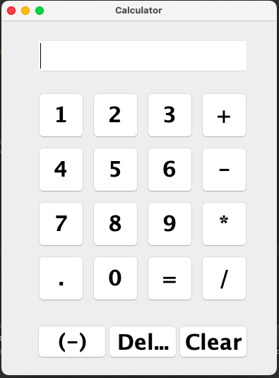
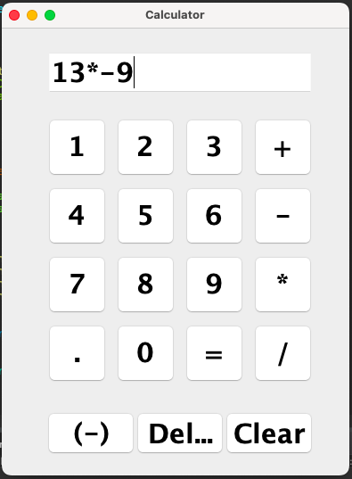
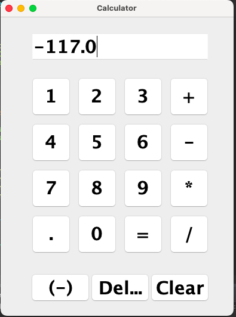

# 🖩 Java Calculator
## 📄 Project Overview

This is a simple GUI-based Calculator built in Java using Swing. It supports basic arithmetic operations along with additional features like negative numbers, decimals, clear, delete, and negate functionality. The calculator handles expressions such as 13*-9 or -13*9 correctly.

## ✨ Features
- Addition, Subtraction, Multiplication, Division
- Negative numbers for both first and second operands
- Decimal numbers
- Clear (C) and ⌫ Delete (Del) buttons
- Negate ((-)) button to switch the sign of numbers
- Operator stays visible until calculation is performed

## 🖱 How to Use
- Clone the repository or download the files.
- Open the project in Eclipse or any Java IDE.
- Run the Calculator.java file.
- Use the buttons to input numbers, operators, and perform calculations.

🖼 Screenshots

🗂 File Structure
Calculator/
├── Calculator.java
├── Calculator.class
├── README.md
└── images/
    └── image-1.png
    └── image-2.png
    └── image-3.png

## ⚙ How it Works
- Numbers and operators are appended to the display (JTextField) as you type.
- Pressing the 🔄 (-) button negates the number currently being entered.
- Pressing = calculates the result based on the current expression.
- Decimal numbers are supported, and invalid inputs show Error.

## 📝 Requirements
Java JDK
